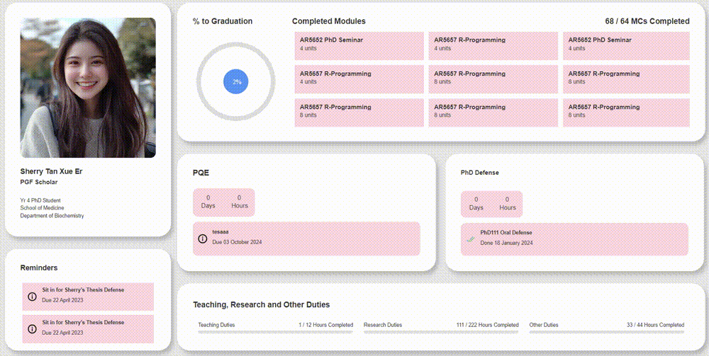

# NUSGS Test Project
A simplified PhD student dashboard designed to track academic progress. It includes features such as a module completion tracker, countdowns for PQE and PhD defense dates, and a duty hours tracker. A custom form allows dynamic input and updating of data on the dashboard using PHP, focusing on functionality and interactivity.

## Tech Stack
* **Frontend:** HTML, CSS, JavaScript
* **Backend:** PHP
* **Server:** Local PHP built-in server

## Software Requirements
PHP installed on your system.

## PHP installation
1. Install PHP from online resources
2. Add PHP to System Path in cmd using: 
   ```
   setx PATH "%PATH%;C:\path\to\php"
   ```
3. Verify by running php -v in command prompt (or Path to php.exe if step 2 skipped).

## How to Run
1. Ensure PHP is installed on your system.
2. Navigate to the project root directory in your terminal.
3. Run the following command:
   ```
   php -S localhost:8000
   ```
4. Open your browser and go to `http://localhost:8000` to view the page.

# How to Use
* **Module Completion Tracking:** Use the custom form to input and update the number of completed modules. The progress towards graduation will be reflected on the dashboard.
* **PQE and PhD Defense Countdown:** Set the dates for PQE and PhD defense using the date picker. The dashboard will display the countdown to these events.
* **Duty Hours Tracker:** Input the completed hours for Teaching, Research, and Other Duties. The dashboard will update the progress for each duty type accordingly.
* **Dynamic Form:** The custom form allows users to input data, and the dashboard will dynamically reflect the changes without the need for a database.

## Screenshots
